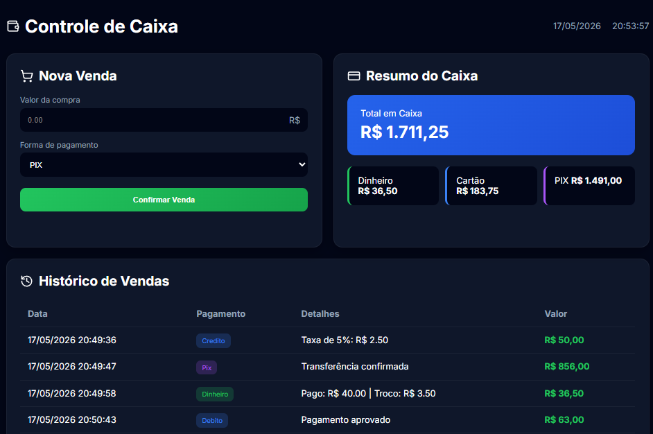

# 💰 Sistema de Controle de Caixa

Sistema de controle de caixa desenvolvido com Python, Flask, HTML, CSS e JavaScript, com registro de vendas e resumo financeiro em tempo real.

---

## 🚀 Funcionalidades

✅ Registro de vendas  
✅ Controle de pagamentos em dinheiro, débito, crédito e PIX  
✅ Cálculo automático de troco  
✅ Taxa automática no crédito  
✅ Histórico de vendas  
✅ Resumo financeiro atualizado em tempo real  
✅ Interface moderna e responsiva  
✅ Feedback visual de sucesso e erro  

---

# 🛠 Tecnologias utilizadas

- Python
- Flask
- HTML5
- CSS3
- JavaScript
- Lucide Icons

---

# 📂 Estrutura do projeto

```plaintext
controle-caixa/
│
├── app.py
├── requirements.txt
├── README.md
│
├── static/
│   ├── css/
│   │   └── style.css
│   │
│   ├── js/
│   │   └── script.js
│   │
│   └── img/
│
├── templates/
│   └── index.html
│
└── utils/
    └── helpers.py
```

## Interface do Sistema



----------

# ⚙️ Como executar o projeto

## 1. Clone o repositório

```bash
git clone https://github.com/AraceleSouza/sistema-controle-caixa.git

```

----------

## 2. Acesse a pasta do projeto

```bash
cd controle-caixa

```

----------

## 3. Instale as dependências

```bash
py -m pip install -r requirements.txt

```

----------

## 4. Execute o projeto

```bash
py app.py

```

----------

## 5. Abra no navegador

```plaintext
http://127.0.0.1:5000

```

----------

# 🎨 Melhorias aplicadas

-   Melhor organização do código
    
-   Separação de responsabilidades
    
-   Interface modernizada
    
-   Melhor experiência do usuário
    
-   Código mais limpo e legível
    
-   Funções auxiliares reutilizáveis
    
-   Melhor tratamento de erros
    
-   Estrutura mais profissional para portfólio
    
-   Responsividade para dispositivos móveis
    

----------

# 🔮 Melhorias futuras

-   Persistência de dados com SQLite
    
-   Dashboard com gráficos
    
-   Exportação de relatórios
    
-   Tema claro/escuro
    
-   Login de usuário
    
-   Filtros no histórico
    
-   Armazenamento do histórico no navegador
    

----------

# 👩‍💻 Desenvolvido por

Aracele Souza